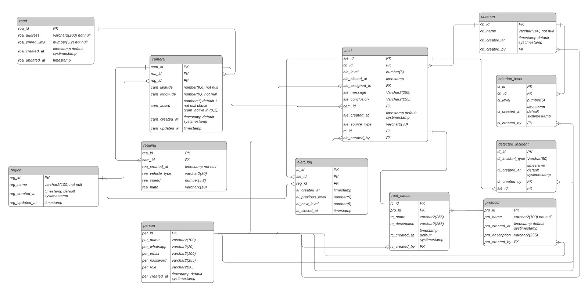

 

# 
Radarius

    <a href="#challenge">Challenge</a>  |
    <a href="#solution">Solution</a>  |
    <a href="#product-backlog">Product Backlog</a>  |
    <a href="#dor">DoR</a>  |
    <a href="#dod">DoD</a>  |
    <a href="#sprint-schedule">Sprint Schedule</a>  |
    <a href="#technologies">Technologies</a> |
    <a href="#installation-manual">Installation Manual</a> |
    <a href="#user-manual">User Manual</a> |
    <a href="#api-documentation">API Documentation</a> |
    <a href="#database-modeling">Database Modeling</a> |
    <a href="#team">Team</a>

> Project Status: Finished ✅   
> Documentation folder: [Link](docs) 📄   
> Project videos: [Public user flow](https://drive.google.com/file/d/1G6b-caz4GOOALUhfYMFFiktgj53RN-BM/view?usp=sharing) / [Agent user flow](https://drive.google.com/file/d/12RU3fXxbnhlbY8p932MR_5re0Mrc_VQK/view?usp=sharing) / [Manager user flow](https://drive.google.com/file/d/1vHfJ08QC7UmmriwL5C7PuEZcnNhNgzLA/view?usp=sharing) / [Admin user flow](https://drive.google.com/file/d/1J-53EJ_zDeAMko_-KFkLkkIGlr-jld9O/view?usp=sharing) 📽️

## 🏅 Challenge

Given the need to improve urban traffic management in São José dos Campos, the challenge is to implement a proactive solution for monitoring and responding to incidents. The city lacks an integrated system that turns radar data into actionable insights, defines specific indicators to trigger alerts and efficiently allocates mobility agents to the most critical areas and situations, optimizing resources and improving traffic flow.

## 🏅 Solution

We developed an Intelligent Traffic Monitoring and Alert System. This solution centralizes traffic control through the radars, allowing the registration of custom indicators and severity levels. Based on these parameters, the system issues automatic alerts, enables the selection of strategic subzones and makes it easy to assign mobility agents to each area. The solution is complemented by an interactive dashboard that offers a consolidated, real-time view of all performance indicators, traffic patterns and agent metrics. Through this dashboard, managers can make fast, data-driven decisions, raising operational efficiency and the quality of traffic management in the city.

→ [Back to top](#radarius)

---

## 📋 Product Backlog

NOTE: Changes were necessary. User stories marked with * (asterisk) were created during Sprint 3 planning due to scope changes (49 hours), and user stories marked with ~ (tilde) were removed because they could not be delivered on time and/or due to scope changes (70 hours).

| Rank | Priority | User Story | Story Points | Sprint |
|-|-|-|-|-|
| 1 | 🔴 High | As a manager, I want traffic information in the form of dashboards, charts and tables to support my decisions on reducing traffic | 48 | 1 |
| 2 | 🔴 High | As a platform user, I want a map on the home screen showing the zone divisions of São José dos Campos, so I can have a detailed view of the places the system has information about | 30 | 1 |
| 3 | 🔴 High | As a public user or agent, I want a screen with the indicators' documentation so I know what is being evaluated on the city map | 42 | 1 |
| 4 | 🔴 High * | As a client, I want each user role (manager, agent and public) to have different access to each feature | 26 | 3 |
| 5 | 🟡 Medium ~ | As a manager, I want the indicators documentation screen (rank 3) to allow adding, editing and deleting indicators, so I have control over the city's traffic monitoring | 22 | 1 |
| 6 | 🟡 Medium ~ | As a manager, I want to be able to change the level definitions of an indicator without changing the number of existing levels, so that alerts, which depend on these levels, are triggered at controlled moments | 12 | 2 |
| 7 | 🟡 Medium | As a manager, I want to be able to assign an agent user or a manager user to a zone, so they receive specific, centralized information to act on | 16 | 2 |
| 8 | 🟡 Medium | As an agent and as a manager, I want to receive alerts when the level of any indicator changes, so I know when traffic gets worse and can take action to solve the problem | 39 | 2 |
| 9 | 🟡 Medium | As a manager, I want zones to include information about the main roads and show congestion on them, so I can act faster and more precisely at critical points in the city | 20 | 2 |
| 10 | 🟡 Medium | As a manager, I want to be able to create "root causes" for triggered alerts and create protocols for these "root causes", so the agent has guidance on how to resolve the alerts that come up | 18 | 2 |
| 11 | 🟡 Medium | As an agent, I want to be able to view a specific alert, so I can document information about it, get information on how to solve the problem that generated it, and close it | 33 | 3 |
| 12 | 🟡 Medium * | As an agent and as a manager, I want to be able to view all alerts in the database | 16 | 3 |
| 13 | 🟡 Medium * | As a manager, I want to be able to view and manage all users in the database | 7 | 3 |
| 14 | 🟢 Low | As a manager, I want logs of the generated alerts, for audit records and to study the history of traffic behavior | 6 | 3 |
| 15 | 🟢 Low ~ | As a manager, I want an internal chat in the product so I can query information in the database in a simplified way | 42 | 3 |

 

    
Original User Stories

     

| Rank | Priority | User Story | Story Points | Sprint |
|-|-|-|-|-|
| 1 | 🔴 High | As a manager, I want traffic information in the form of dashboards, charts and tables to support my decisions on reducing traffic | 48 | 1 |
| 2 | 🔴 High | As a platform user, I want a map on the home screen showing the zone divisions of São José dos Campos, so I can have a detailed view of the places the system has information about | 30 | 1 |
| 3 | 🔴 High | As a public user or agent, I want a screen with the indicators' documentation so I know what is being evaluated on the city map | 42 | 1 |
| 4 | 🟡 Medium | As a manager, I want the indicators documentation screen (rank 3) to allow adding, editing and deleting indicators, so I have control over the city's traffic monitoring | 22 | 1 |
| 5 | 🟡 Medium | As a manager, I want to be able to change the level definitions of an indicator without changing the number of existing levels, so that alerts, which depend on these levels, are triggered at controlled moments | 12 | 2 |
| 6 | 🟡 Medium | As a manager, I want to be able to assign an agent user or a manager user to a zone, so they receive specific, centralized information to act on | 16 | 2 |
| 7 | 🟡 Medium | As an agent and as a manager, I want to receive alerts when the level of any indicator changes, so I know when traffic gets worse and can take action to solve the problem | 39 | 2 |
| 8 | 🟡 Medium | As a manager, I want zones to include information about the main roads and show congestion on them, so I can act faster and more precisely at critical points in the city | 20 | 2 |
| 9 | 🟡 Medium | As a manager, I want to be able to create "root causes" for triggered alerts and create protocols for these "root causes", so the agent has guidance on how to resolve the alerts that come up | 18 | 2 |
| 10 | 🟡 Medium | As an agent, I want to be able to view a specific alert, so I can document information about it, get information on how to solve the problem that generated it, and close it | 33 | 3 |
| 11 | 🟢 Low | As a manager, I want logs of the generated alerts, for audit records and to study the history of traffic behavior | 6 | 3 |
| 12 | 🟢 Low | As a manager, I want an internal chat in the product so I can query information in the database in a simplified way | 42 | 3 |

→ [Back to top](#radarius)

---

## 🏃‍  DoR - Definition of Ready
- User Stories with Acceptance Criteria
- Subtasks broken down from the USs
- Design in Figma
- Database Modeling
- Route Diagram
- Client's Vectorized Database

## 🏆 DoD - Definition of Done
- Installation Manual
- User Manual
- API (Application Programming Interface) Documentation
- Complete code
- Videos of each delivery stage

→ [Back to top](#radarius)

---

## 📅 Sprint Schedule

| Sprint | Period | History |
|-|-|-|
| SPRINT 1 | 09/08 - 09/28 | [Sprint 1 Docs](docs/processo/sprints/sprint-1/README.md) |
| SPRINT 2 | 10/06 - 10/26 | [Sprint 2 Docs](docs/processo/sprints/sprint-2/README.md) |
| SPRINT 3 | 11/03 - 11/23 | [Sprint 3 Docs](docs/processo/sprints/sprint-3/README.md) |

→ [Back to top](#radarius)

---

## 💻 Technologies

  
  
  
  
  
  
  
  
  
  
  

→ [Back to top](#radarius)

---

## 📖 Installation manual

Access the manual via this [Link](docs/install/README.md)
 

→ [Back to top](#radarius)

---

## 📘 User manual

Access the manual via this [Link](https://drive.google.com/file/d/1L-FXcJWop9PP2Nl430whKPjNdSdH5czI/view?usp=sharing)
 

→ [Back to top](#radarius)

---

## 📓 API Documentation

Access the Swagger documentation via this [Link](https://drive.google.com/drive/folders/1cTevsjRi3AkroBniEprjlUZcLx0zNM3g?usp=sharing)

→ [Back to top](#radarius)

---

## 🖥️ Database Modeling

→ [Back to top](#radarius)

---

## :busts_in_silhouette: Team

|    Role       | Name                  | LinkedIn & GitHub |
|---------------|-----------------------|-------------------|
| Product Owner | Augusto Piatto        |   |
| Scrum Master  | Beatriz Sthefanny     |   |
| Dev Team      | Caio Osorio           |   |
| Dev Team      | Davi Soares           |   |
| Dev Team      | João Paulista         |   |
| Dev Team      | Rafael Slivka         |   |
| Dev Team      | Tiago Bernardo        |   |
| Dev Team      | Tiago Torres          |   |
| Dev Team      | Victor Ryan           |   |

→ [Back to top](#radarius)
