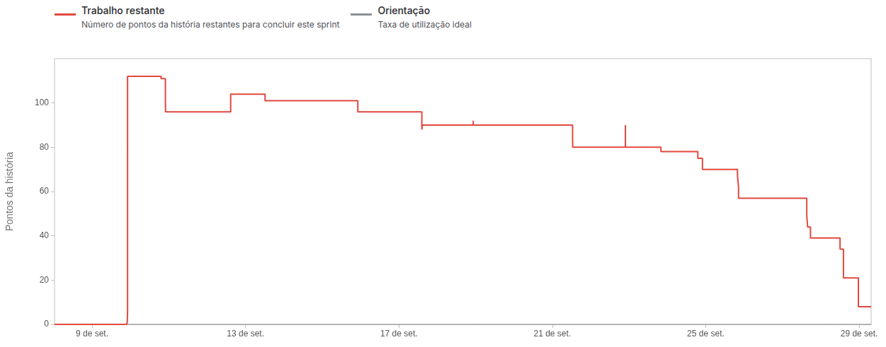

# Documentation - Sprint 1

## 
Radarius

    <a href="#challenge">Challenge</a>  |
    <a href="#user-stories">User Stories</a>  |
    <a href="#dor">DoR</a>  |
    <a href="#dod">DoD</a>  |
    <a href="#burndown">Burndown</a>  |
    <a href="#team">Team</a>

> Sprint Status: Done ✅

## 🏅 Challenge

Build the foundation of the system, allowing managers and users to follow urban mobility indicators through interactive dashboards, zone maps and technical documentation of the indicators. It was necessary to ensure a clear interface and flow so the system could evolve without rework.

## 📋 User Stories

Estimated team capacity for the Sprint: 135 Story Points (hours)

Sprint Goal: User Stories ranked 1 and 2 (78 Story Points in total)

Sprint Forecast: User Story ranked 3 (42 Story Points)

| Rank | Priority | User Story | Story Points | Sprint |
|-|-|-|-|-|
| 1 | 🔴 High | As a manager, I want traffic information in the form of dashboards, charts and tables to support my decisions on reducing traffic | 48 | 1 |
| 2 | 🔴 High | As a platform user, I want a map on the home screen showing the zone divisions of São José dos Campos, so I can have a detailed view of the places the system has information about | 30 | 1 |
| 3 | 🔴 High | As a public user or agent, I want a screen with the indicators' documentation so I know what is being evaluated on the city map | 42 | 1 |

## 🏃‍ DoR

|             Criterion             | Description                                                                                       |
| :-------------------------------: | ------------------------------------------------------------------------------------------------- |
|       Clear Description           | The User Story is written in the format "As a [persona], I want [action] so that [goal]"          |
| Defined Acceptance Criteria       | The story has objective criteria that indicate what is needed to consider it done.                |
|      Shared Understanding         | The whole team (including PO and devs) understands the purpose of the story.                      |
|            Estimable              | The story was scored in Planning Poker or has a clear estimate.                                   |
|       Supporting Documents        | When needed, mockups, flows or data models are attached or referenced.                            |
|  Validated with PO and team       | The story was discussed in refinement or planning and validated with the technical team.          |
|   Agreed Technical Criteria       | Frontend and Backend needs were clearly separated (when applicable).                              |

## 🏆 DoD

|                 Criterion                | Description                                                                                                      |
| :--------------------------------------: | ---------------------------------------------------------------------------------------------------------------- |
|        Acceptance Criteria met           | All scenarios defined in the US were implemented and successfully validated.                                     |
|    Test Scenarios run and approved       | All described scenarios were manually validated.                                                                 |
|      Visual Feedback Implemented         | Features such as pop-ups, error messages or progress bars are clear and accessible to the user.                  |
|        Safe and Controlled Flow          | There are no broken paths or inconsistent submissions in the evaluation or navigation flow.                      |
|        Code Reviewed (Code Review)       | The code was reviewed by at least one teammate.                                                                  |
|     Internal Documentation Updated       | Whatever was needed was updated: API, data structures, endpoints, etc.                                           |
|  Integration With the Rest of the App    | The feature was tested together with the full system flow (e.g. Submit → Response → Evaluation → Choice).        |
|             PO Validation                | The PO tested and confirmed that the feature works as expected.                                                  |
|            Ready for deploy              | The feature can be delivered to production/final testing with nothing pending.                                   |

## 📉 Burndown

## 👥 Team

|    Role       | Name                  | LinkedIn & GitHub |
|---------------|-----------------------|-------------------|
| Product Owner | Augusto Piatto        |   |
| Scrum Master  | Beatriz Sthefanny     |   |
| Dev Team      | Caio Osorio           |   |
| Dev Team      | Davi Soares           |   |
| Dev Team      | João Paulista         |   |
| Dev Team      | Rafael Slivka         |   |
| Dev Team      | Tiago Bernardo        |   |
| Dev Team      | Tiago Torres          |   |
| Dev Team      | Victor Ryan           |   |

