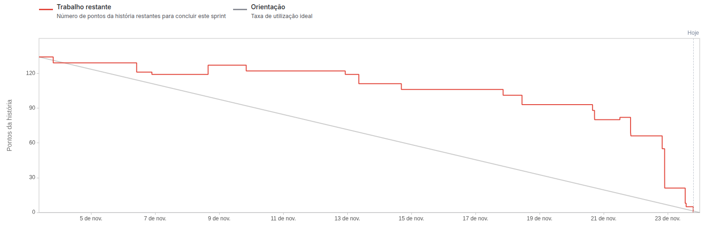

# Documentação - Sprint 3

## 
User-Standart

    <a href="#desafio">Desafio</a>  |  
    <a href="#user-stories">User Stories</a>  |   
    <a href="#dor">DoR</a>  |  
    <a href="#dor">DoD</a>  |  
    <a href="#burndown">Burndown</a>  |  
    <a href="#equipe">Equipe</a>

> Status da Sprint: Concluída ✅

## 🏅 Desafio

Implementar funcionalidade que aprimorem a experiência do usuário para o controle de informações existentes na base, garantindo maior controle desses dados. Nessa sprint será feita a separação funcionalidades por permissões de usuários, telas de usuários e alertas, e visualização de níveis de indicadores no mapa da tela inicial, garantindo maior confiabilidade e controle nas decisões.

## 📋 User Stories

Capacidade estimada da Equipe na Sprint: 107 Story points (horas)

Meta da Sprint: User Stories de rank 4, rank 6, rank 8, rank 12 e rank 13 (total de 91 Story Points)

Previsão da Sprint: User Story de rank 11 (6 Story Points)

OBS: Foram necessárias alterações. Os user stories com * (asterisco) foram criados no planejamento da sprint 3, devido à mudanças no escopo (49 horas)

| Rank | Prioridade | User Story | Estimativa | Sprint |
|-|-|-|-|-|
| 4 | 🔴 Alta * | Como cliente, quero que cada permissão de usuário (gestor, agente e público) tenham acessos diferentes à cada funcionalidade | 26 | 3 |
| 6 | 🟡 Média | Como gestor, quero poder associar um usuário agente a uma zona ou usuário gestor a uma zona, para que recebam informações específicas e centralizadas para atuar | 16 | 3 |
| 8 | 🟡 Média | Como gestor, quero que as zonas tenham informações das principais vias demarcadas e que apresentem a qualidade dessa via, para que eu possa atuar de forma mais rápida e precisa em pontos críticos da cidade | 26 | 3 |
| 12 | 🟡 Média * | Como agente e como gestor, quero poder visualizar todos os alertas disponíveis na base | 16 | 3 |
| 13 | 🟡 Média * | Como gestor, quero poder visualizar e manipular todos os usuários disponíveis na base | 7 | 3 |
| 14 | 🟢 Baixa | Como gestor, quero ter logs dos alertas gerados, para registro de auditoria e estudo de histórico do comportamento do trânsito | 6 | 3 |

User stories removidos por incapacidade de atender no prazo e / ou mudanças no escopo (70 horas)

| Rank | Prioridade | User Story | Estimativa | Sprint |
|-|-|-|-|-|
| 5 | 🟡 Média | Como gestor, quero que a tela de documentação dos indicadores (rank 3) ofereça a possibilidade de adicionar, editar e deletar os indicadores, para que eu tenha controle sobre o monitoramento do trânsito da cidade | 16 | 3 |
| 6 | 🟡 Média | Como gestor, quero ter a possibilidade de alterar as definições dos níveis referentes a um indicador sem modificar a quantidade de níveis existentes, para que o disparo de alertas, que dependem desses níveis, ocorram em momentos controlados | 12 | 3 |
| 15 | 🟢 Baixa | Como gestor, quero um chat interno no produto para que eu possa consultar informações que estão no banco de forma simplificada | 42 | 3 |

## 🏃‍ DoR

|             Critério              | Descrição                                                                                         |
| :-------------------------------: | ------------------------------------------------------------------------------------------------- |
|       Clareza na Descrição        | A User Story está escrita no formato “Como [persona], quero [ação] para que [objetivo]”           |
| Critérios de Aceitação Definidos  | A história possui critérios objetivos que indicam o que é necessário para considerá-la concluída. |
|   Referência Visual no Figma      | O protótipo correspondente está disponível e vinculado (quando aplicável ao front-end).           |
|     Escopo Técnico Validado       | Está claro se a história envolve frontend, backend ou ambos.                                      |
|    Perfil de Acesso Definido      | O tipo de usuário (comum ou administrador) está claramente definido para cada história.           |
|    Compreensão Compartilhada      | Toda a equipe (incluindo PO e devs) compreende o propósito da história.                           |
|            Estímável              | A história foi pontuada no Planning Poker ou tem uma estimativa clara.                            |
|       Documentos de Apoio         | Se necessário, mockups, fluxos ou modelos de dados estão anexados ou referenciados.               |
|    Validação com PO e Equipe      | A história foi discutida em refinamento ou planning e validada com o time técnico.                |
|   Critérios Técnicos Acordados    | As necessidades de Frontend e Backend foram claramente separadas (quando aplicável).              |
| Alinhamento com arquitetura atual | A funcionalidade proposta está coerente com o funcionamento já entregue na Sprint 1 e Sprint 2.   |

## 🏆 DoD

|                 Critério                 | Descrição                                                                                                        |
| :--------------------------------------: | ---------------------------------------------------------------------------------------------------------------- |
|     Critérios de Aceitação atendidos     | Todos os cenários definidos na US foram implementados e validados com sucesso.                                   |
| Cenários de Teste executados e aprovados | Todos os cenários descritos foram validados manualmente.                                                         |
|      Feedback Visual Implementado        | Funcionalidades como pop-ups, mensagens de erro ou barras de progresso estão claras e acessíveis ao usuário.     |
|        Fluxo Seguro e Controlado         | Não há caminhos quebrados nem submissões incoerentes no fluxo de avaliação ou navegação.                         |
|      Código Revisado (Code Review)       | O código foi revisado por pelo menos um colega de equipe.                                                        |
|     Documentação Interna Atualizada      | Foi atualizado o que for necessário: API, estrutura de dados, endpoints, etc.                                    |
|  Integração Com o Restante da Aplicação  | A funcionalidade foi testada junto com o fluxo completo do sistema (Ex: Envio → Resposta → Avaliação → Escolha). |
|             Validação do PO              | O PO testou e confirmou que a funcionalidade atende ao esperado.                                                 |
|            Pronto para deploy            | A funcionalidade pode ser entregue ao ambiente de produção/testes finais sem pendências.                         |

## 📉 Burndown

## 👥 Equipe

|    Função     | Nome                  | LinkedIn & GitHub |
|---------------|-----------------------|-------------------|
| Product Owner | Augusto Piatto        |   |
| Scrum Master  | Beatriz Sthefanny     |   |
| Dev Team      | Caio Osorio           |   |
| Dev Team      | Davi Soares           |   |
| Dev Team      | João Paulista         |   |
| Dev Team      | Rafael Slivka         |   |
| Dev Team      | Tiago Bernardo        |   |
| Dev Team      | Tiago Torres          |   |
| Dev Team      | Victor Ryan           |   |

